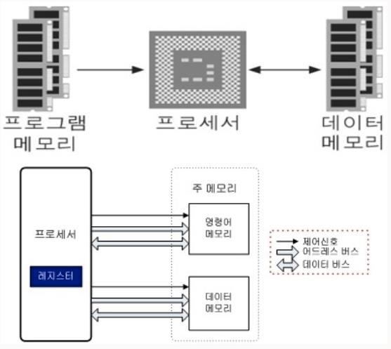

## 컴퓨터의 역사: 폰노이만 구조가 나오기전 (요약)

처음으로 이론적 모델을 제시한 사람은 영국의 수학자 **앨런 튜링**.

 “On Computable Numbers, with an Application to the Entscheidungsproblem (1937)“ 발표한 논문에서 튜링 기계(Turing Machine)을 소개하였고, 이는 표에 정의된 각 기호의 규칙대로 긴 테이프에 적힌 기호를 처리하는 추상 장치 였다.

즉, 컴퓨터에 대한 수학적 모델을 정의한 것이다 (여기서 튜링 머신에 입력되는 기호가 적인 테이프를 소프트웨어라고 볼 수 있다)

이후 앨런 튜링은 세계 2차대전 동안, 독일 암호문을 해독하는 Bombe라는 장치를 만들어 연합군 승리에 큰 기여를 한다. 이처럼, 2차 대전 기간에 만들어진 컴퓨터는 특정 목적에서만 사용되었으나, 전쟁이 끝나갈 무렵 미국에서는 다용도 컴퓨터인 **에니악(ENIAC)**을 만들기 시작했다.

에니악은 펜실베니아 대학 존 에커트와 존 모클리 교수팀이  1943년 부터 개발을 시작하여 1946년에 완성하였다.

이후, 미군에 배치되어 미사일 탄도 계산을 위해 사용되었다. 프로그래밍 방식이 지금과  아주 다른데, **일일히 배선을 연결해서 코딩을 해야 했고, 다른 프로그램을 실행하려면 배선판을 바꿔야 했다.** 게다가 무게는 30톤이였으며, 18000개의 진공관을 사용했기 때문에 200KW의 전기를 소모해야만 했다. (일반인이 손으로 계산하는 것보다 20만 배나 빠른 초당 5000번의 연산을 할 수 있었다.)

에니악을 만들었던 팀은 1944년 부터 세계 최초로 프로그램 내장 방식인 **에드박(EDVAC) 개발**시작하여 1949년 미군 탄도 연구소(ballastics research laboratory)에 납품한다. **폰 노이만은 컨설턴트로 개발에 참여**하여 1945년 First Draft of a Report on the EDVAC 보고서를 작성하는데, 여기서 **같은 메모리에 프로그램과 데이터가 저장되는 컴퓨터 구조를 제안**한다.

##### 지금도 모든 컴퓨터는 이와 같은 컴퓨터 구조를 사용하고 있고, 이를 폰노이만 구조라고 부른다.

---

## 폰 노이만 (Von Neumann) 구조  :프로그램 내장 방식

#### :프로그램과 데이터를 하나의 메모리에 저장하여 사용하는 방식, 데이터는 메모리에 읽거나 쓰는 것이 가능하지만 명령어는 메모리에서 읽기만 가능하다.

그림에서 볼 수 있듯이,  **폰노이만 구조는 크게 CPU, 메모리, 입출력 장치로 구성**되어 있으며, CPU안에는 산술/논리장치, 프로세서 레지스터를 포함하고 있는 처리 장치(Processing Unit)와 명령어 레지스터와 프로그램 카운터를 포함하는 제어장치로 구성된다. 메모리는 데이터와 명령어를 함께 저장할 수 있다.

#### 

##### 폰 노이만 구조방식은 **CPU(Central Processing Unit)**와 한 개의 메모리를 사용하여 처리하는 현대의 범용 컴퓨터들이 사용하는 구조 모델이다

폰노이만 구조의 디지털 컴퓨터에서는 **‘저장된 프로그램’(stored-program)의 개념**이 도입되었다. 이는 프로그램을 구성하는 명령어들을 **임의 접근이 가능한 메모리 상**에 순차적으로 배열하고, 동시에 **조건 분기(조건에 따라 메모리의 특정 위치에 있는 명령어를 불러와 실행 하는 것)**를 무제한적으로 허용 한다는 것을 뜻한다.

폰노이만 구조에서는 같은 메모리 속에 실행코드와 데이터가 **따로 구분되지 않고 함께 섞여 있다.**

#### **장점**

컴퓨터에 다른 작업을 시킬 경우 하드웨어(전선)을 재배치 할 필요가 없이 **SW(프로그램)만 교체하면되기 때문에 범용성(여러 목적사용 가능) 이 향상 **됨에 따라 현대 컴퓨터가 폰 노이만 구조를 따르고 있다

#### **단점**

메모리와 CPU를 이어주는 통로를 BUS라 칭하는데 **이 통로가 하나**기 떄문에 폰 노이만 구조는 순차적으로 정보를 처리 함으로 고속 병렬처리에는 부적합하다

이에 대한 문제를 **폰 노이만 병목(Von-Neumann Bottleneck)** 현상이라고 한다

(구체적으로 말하면 폰 노이만 구조는 CPU가 메모리로부터 명령어도 읽고, 데이터도 읽는 여러 일을 혼자 하게 된다. 하지만 명령어를 읽는 동시에 데이터를 읽지는 못하기 때문에 이와 같은 문제가 발생하게 된다)

폰 노이만 구조에 대한 단점을 해결 하기위해 나온 대안으로 **하버드(Harvard) 구조** 가 있다

*이 밖에도  DMA, 뉴로모르픽 컴퓨팅 등이 있다*

---

## 하버드(Harvard) 구조

####  : 폰 노이만 아키텍처의 단점을 보안 하기 위해 만든 변형으로 명령어와 데이터가 **서로 물리적으로 다른 메모리 영역을 차지**하며, 메모리 영역 마다 주소 통로(bus) , 데이터 통로(bus) , 제어 통로(bus) 가 따로 존재한다

하지만 위와 같은 하버드 구조는 명령어를 읽을 떄나 데이터를 읽을 때 성능이 우수며 상대적으로 적은 수의 명령어를 가진다. **하지만,  BUS 시스템이 복잡하여 설계가 어렵다**

메모리를 명령어가 저장되는 곳과 데이터를 저장하는 곳으로 구분한 하버드 아키텍처가 있다. 현대의 컴퓨터는 외부적으로는 폰노이만 구조를 쓰고 있으나, CPU 내부적으로는 하버드 아키텍처를 적용 해서 속도를 향상시킨 것이 많다. **그러나 이것 또한 폰노이만 구조를 기반으로 만들어진 것이기 때문에, 병목현상만 어느 정도 해결할 뿐 메모리 속의 프로그램을 순차적으로 실행하는 근본적인 구조 자체는 변하지 않는다.**

---

출처: https://codingisgame.tistory.com/8

출처: https://codingisgame.tistory.com/7

출저: https://kldp.org/node/160414

출저: https://ko.wikipedia.org/wiki/%EC%BB%B4%ED%93%A8%ED%84%B0%EC%9D%98_%EC%97%AD%EC%82%AC

출저: https://kldp.org/node/160414

출저: https://ko.wikipedia.org/wiki/%ED%8A%9C%EB%A7%81_%EA%B8%B0%EA%B3%84

출저: https://m.post.naver.com/viewer/postView.nhn?volumeNo=17199271&memberNo=36047368
