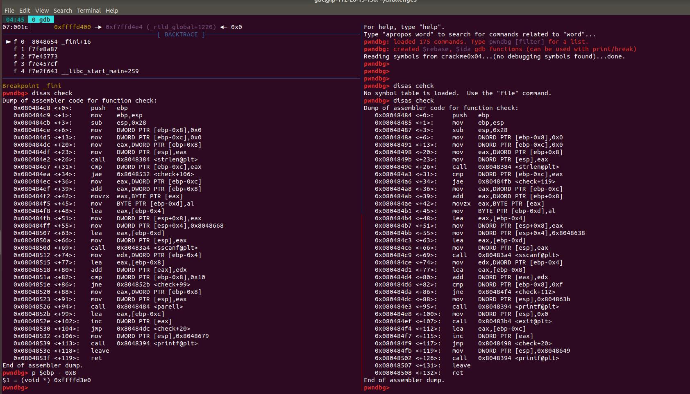

## crackme0x04 

### 

1. ##### 일단 main의 리턴되기 직전 부분에 break point를 걸고 실행 시켜서 레지스터에 값들이 들어가도록 한다. (break _fini를 해준다)

2. ##### 그리고 분기가 일어나는 곳을 찾아서, check함수의 구성을 확인해본다.

3. ##### 파라미터로 들어온 eax와 값이 cmp되는 부분의 ebp-0xc의 값을 확인한 후 16진수를 10진수로 바꾼다

##### 위의 값을 입력해 주면 **Password OK!**가 뜬다!

## crackme0x05

1. ##### 1번과 비슷하게 생각해서 main이 리턴되기 직전 부분에 break를 걸어두고 실행 시켜서 레지스터에 값들이 들어가도록 한다. (break _fini를 해준다)

2. ##### 그리고 분기가 일어나는 곳을 찾아서, check함수의 구성을 확인해본다.

3. ##### 파라미터로 들어온 eax와 값이 cmp되는 부분의 ebp-0xc의 값을 확인한 후 16진수를 10진수로 바꾸어서 트라이 해보았지만 되지 않아서,  그부분에 해당 하는 값을 다 대입해 봤지만 실패가 되었다.

4. ##### 그래서 그다음 cmp로 넘어가서 값을  다 대입하다가 마지막 0를 삭제하고 대입했는데

   

   ##### 성공해서 **Password OK!**가 나왔다.

   

   

   

##### 그 이유를 찾고자 4번째 파일과 비교해보고 여러 가능성을 생각해 보며 지금까지 ing 중이다!

##### -값은 계속적으로 바뀌고, 메모리의 주소값을 사용해서 만든 것이 아닐까

##### -shl를 사용해서 값을 그렇게 바꾸었을 거라고 생각하고 찾아봤는데.. 잘 찾지 못했다.

##### -4번하고 다른점은 exit를 안하고 parell를 하는  것 인데,,,, 차이점을 잘 못찾겠다.