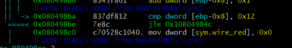

# yellow bomb password 찾기_HW5

일단 chmod 777 bomb으로 실행파일의 접근권한을 바꾸어 준다.

그후 r2 -Ad ./bomb으로 radare를 실행해서 비밀 번호찾기를 시작한다.

jnz: 비교값이 같지 않으면 점프

jz : 비교값이 같으면 점프

eax이 가르키는 값과 al이 가르키는 값은 같다.

yellow함수를 살펴 보면, eax 레지스터에 buffer의 값을 한 byte씩 넣고 한값 한값을 cmp한다.

다를 경우는 0x804977로 점프하고, 값이 같을 경우는 다음 값을 비교한다.

값비교가 다 맞을 경우에는 0x804978b로 이동한다.

#### 성공했을 경우에는  sym.imp.inputs를 call하고 sym.wire_yellow초기화(0x0처리)해준 다음, leave ret를 하고 함수를 끝낸다

#### 틀린경우는 sym. wire_yellow 값을 shl해서(eax를 0xa(10))만큼 shift해주고 함수를 leave ret를 해준다.

그래서 sym. wire_yellow의 값을 확인 했는데 딱히 무엇을 하고자하는 목적은 찾지 못했다.

괜히 다른 값을 더 넣어주기 위함때문일까? 처음과 같이 않게만 만들기 위해?

#### 그래서 비밀번호는  

0x38 0x34 0x33 0x37 0x31 0x30 0x36 0x35를 십진수로 바꾼,

5652515549485453이라고 생각했는데, 84371065

#### 결과는 처참했다.     *그런데 실패하니깐 segemetation fault가 뜬다 이유가 뭘까?*

결국 이유를 못찾고 hint를 살펴보니 10진수가 아니라 string값으로 값을 찾는 것이였다

#### 그래서 16진수를 각각 84371065로 바꾼 것이 yellow의 비밀번호 인  것이다.

#### [결론]: yellow함수에 있는 cmp의 16진수들이 비밀번호 각 byte값들이었고 이를 string으로 변환한 것이 비밀번호이다. 또한 일치할때 wire_yellow의 값을  0x0로 바꾸는 것을 보아, wire_yellow 의 값을 0으로 바꾸어 주는 것이 끈을 끊어 내는 것 같다.

# Red bomb password 찾기_

Red도 yellow처럼 풀어보고자 하였으나, 다가가는 방식이 확연히 달라서 힌트를 얻기 위해 시작 부분 처음 부분 힌트를 읽고 시작하였다.

#### 끈이 끊어지는 경우 = wire_색깔의 부분이 다 0x0으로 처리 되는 경우

해당 부분이 위에 경우에 해당되었다.

jle= 두번째 값이 크거나 같은 경우 지정된 주소로 점프 이기 때문에 [ebp-0x8]의 주소값에 들어있는 값보다 0x12가 작아야만  폭탄 제거가 가능하다.

흐름을 살펴보자면,

------

#### 연산자 설명

=======
>>>>>>> daef5b078b61c5f66f421d0956e30dcfd1f376e2
