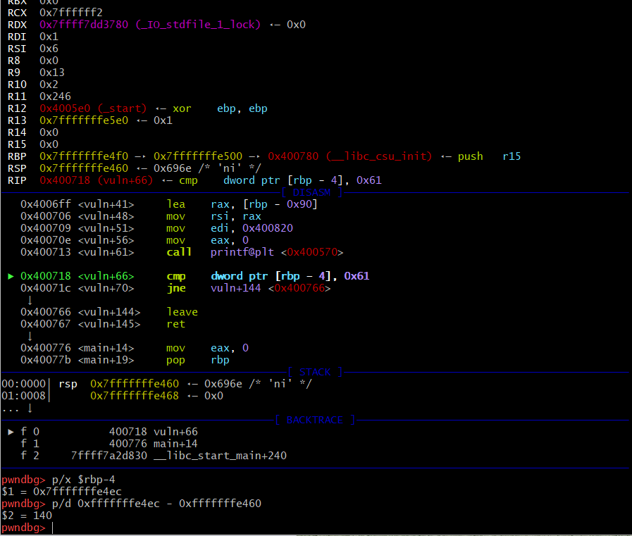
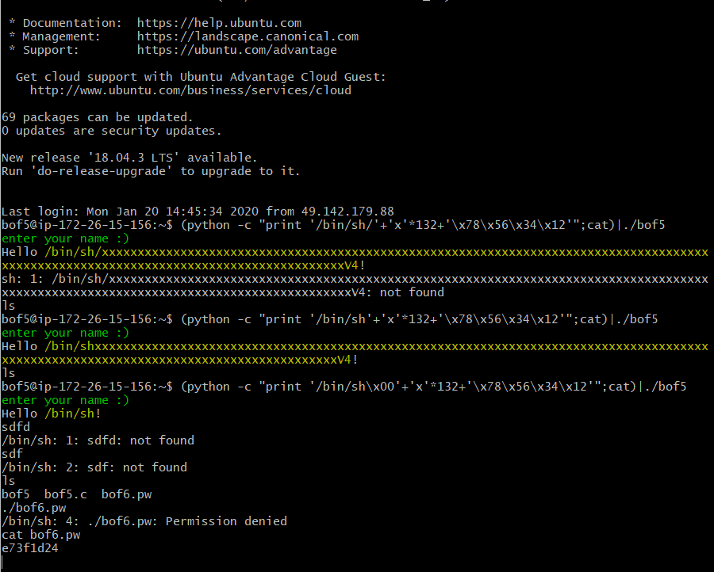

## HW6_

#### bof3 비밀번호 찾아 내기

##### 

일단 gets로  문자열을 받고 innocent를 key 값을 비교해서 bof4로 쉘이 실행되서 bof4.pw를 읽을 수 있도록 하는 것이다.

gets는 배웠듯이 입력받은 값을 버퍼에 저장할 때 입력 데이터의 길이를 검증하지 않고 입력값을 받기 대문에, 주소값을 찾의 차이를 알아내어 그사이를 다른 값으로 채우고 innocent에 고정 된 KEY값을 넣어 주는 것이 중요하다.

gdb를통해 gets의 주소값과 key값을 비교하는 곳의 주소값의 차이를 알아내서 그 값만큼 아무 값이나 넣게 하고,

이렇게 값을 넣어줌으로써 쉘이 작동되어 bof4의 비밀번호를 알아 낼 수 있게 되었다. 

신기한건 딱히 널처리를 안하고 해당 값만 맞으면 해결이 가능하다는 것이다!ㅇ

p.s. 여기서는 args로 받는게 아니라, 함수를 실행한뒤 계속 넣어주는 것이여서 형식이 저렇다.

---

##### 파이프란, 어떠한 프로세서의 출력이 그 다음 프로세스의 입력이 되는 것을 말한다. 

---

#### bof4 비밀 번호 알아내기

그 다음은 bof4인데, 이때에는 strcpy로 값을 받아 내었다. 

#### 검색해 보니 argc의 기본값은 1이기 때문에, 한개의 파라미터를 받으려면 최소 argc가 두개 이상이여야 했다.

p.s. 실행파일도 인자로 치기 때문이다. *그럼 그뒤로 받는 값들을 모두 argc로 받는 것인가?*

그래서 strcpy로 값을 받는 곳과 key값을 비교하는 cmp의 주소값을 비교해서 그 값만큼 다른 값을 넣고자 하였다.

그리고 하던데로 0x12345678을 스트링 값으로 바꾸고자 하였는데, 

이런 이상한 값이 나오고, 빨간점부분은 바꾸지 못한 부분 인것 같았다. 

그래서 저거로 우겨서 넣어보자 했는데 안되더라;; \x78\x56\x36\x12 이 값이 변하는게 xV4로 넣어도 안되는 것 이해가 되지 않았다. 

아무래도 리틀 엔디안 방식때문에 거꾸로 저장되는 것 같은데, 여기서 궁금한 점은 리틀에디안이 거꾸로 저장된다고해서 바로 아스키 코드로 바뀌는 것인가 라는 생각이다. 왜 되는지 찾아봐야겠따.

결론적으로 저렇게 입력하였을 때, bof5의 권한을 받아   bof5.pw의 결과 값을 볼 수 있었다. 

마지막으로, 

---

## bof5 비밀번호 찾아내기

bof5의 소스코드 이다. 4번과 달라진게 있다면,   buf의 값으로 /bin/sh/를 받아 창을 쓸수 있도록 하는 점이다. 그래서 처음 생각은 전처럼  system의 값을 받는 부분의 주소값을 알아내서 차이를 알아내야겠다고 생각을 했는데, 

왜때문에 ni으로 넘겻는데도 자꾸 자꾸 패스를 하는지 모르겠다.

주소 값으로 차이를 찾는 것은 포기하고, 왜 때문에 140에서 -8를 한 값인지를 생각해 봤을때

#### /bin/sh

하나의 캐릭터씩 1byte씩 차지하기 때문에 총 7byte값이 든다. 

그리고 마지막 값은 널을 의미하는게 아닐까 생각해서 막 값을 넣어보았는데, 

널처리 값이 맞는 것 같다. 무엇을 집어 넣어도 null에 해당한다면 널로 받아드리는 것 같다. 

그래서 이게 1byte를 차지하기 때문에 총 8byte가 되어서 나머지 값이 총 132개가 되는 것이다.

결론적으로  bof6의 비밀번호는 이렇게 된다. 