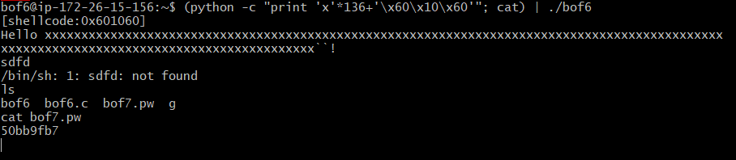

## hw7

#### bof6 문제 풀기

bof6.c의 코드를  보았을때 return 값을 shellcode의 주소값으로 덮어 씌워서  해당 파일의 권한으로 shell를 사용할 수 있도록 하는 것이다.

그래서 맨처음에는 gets함수가 끝나는 부분의 return값의 주소값이라고 생각해서 밑에 처럼 찾아보았는데 아니였다.

그래서 이 함수의 마지막 return값이지 않을까 생각해서 값을 찾아 봤는데, 이것도 딱히 맞는 값인 것 같지는 않다. 

##### (python -c "print 'x'*136+'\x10\x50\x75\x55\x55\x55\x00\x00'";cat) | ./bof6

의 값이 어떻게 나왔는지 끼워 맞추는 것이 최선이라고 생각했다.

이 그림을 보았을 때, 일단 140에서  SFP를 빼서 136의 쓰레기값을 넣어주고 그 다음에 RET의 값이 온다는 것을 알 수 있다

여기보면 shellcode의 주소값이 0x601060이여서 이값을 return값에 쓰면 된다고 생각했는데 선부른 판단이었나보다.

근데 재현이가 주소값을 그대로 넣어보라고 했는데, 넣으니깐 되었다.....

생각만하고 실천할 생각을 못했네...답이 틀렸을거라고 생각을 못했다...!

비밀번호:50bb9fb7

---

#### bof7 문제 풀기

